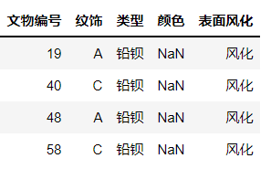

## 数据预处理

### 1.1 数据清洗

##### 1.1 处理缺失值
对于表单1的数据，我们首先找出缺失值，缺失值数据如图1所示(<b>建议重新画个表</b>)

可以观察到，表单1的数据仅存在颜色属性的缺失，缺失数据量为4，缺失量较少，可以忽略。
##### 1.2 处理异常值
求和
    
### 数据规约

由于表单2中不同的化学成分含量相差较大，故考虑首先对各列化学成分数据进行标准化处理，使处理后的数据更加能体现该化学成分含量的相对大小，使数据更加直观且具有可比性。此处使用了最小——最大规范化方法(minmax-scale)，方法公式如下：
  $$ x_{i} = \frac{x-x_{min}}{x_{max}-x_{min}}$$