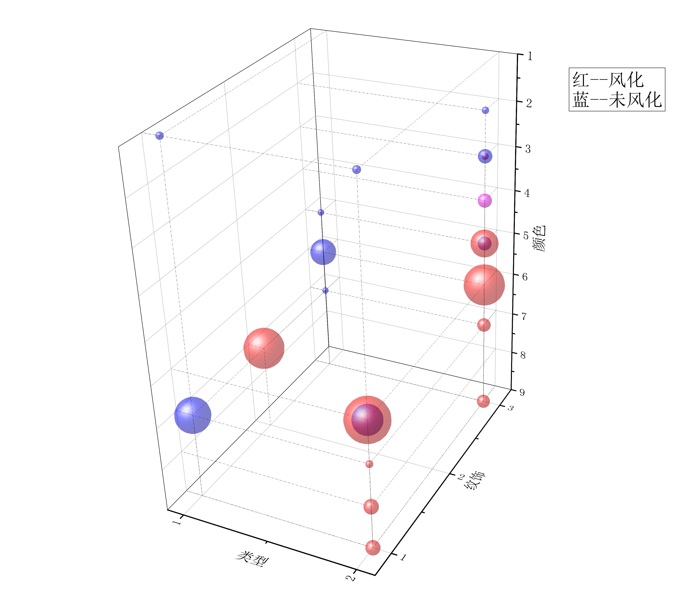
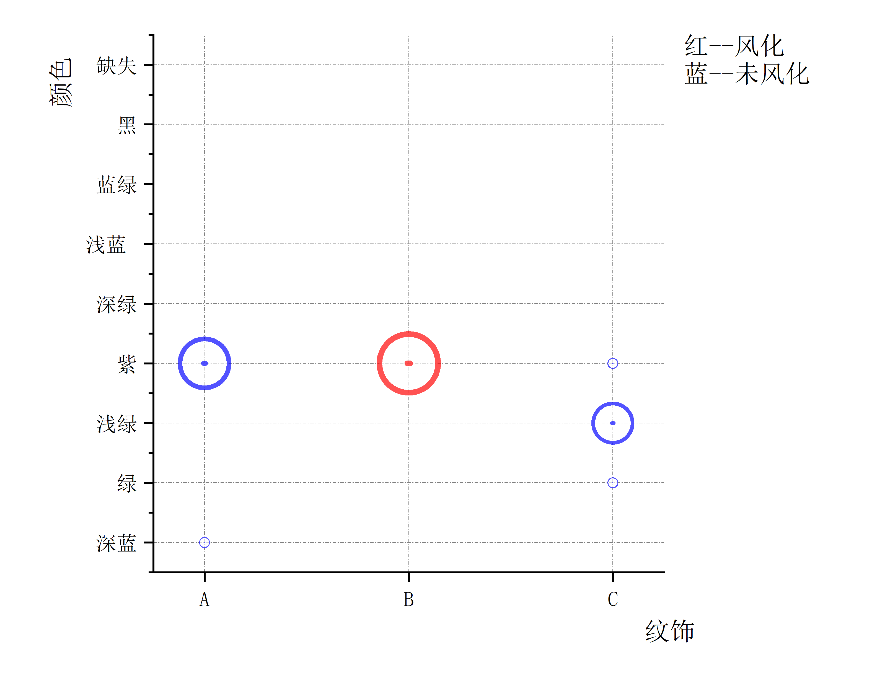
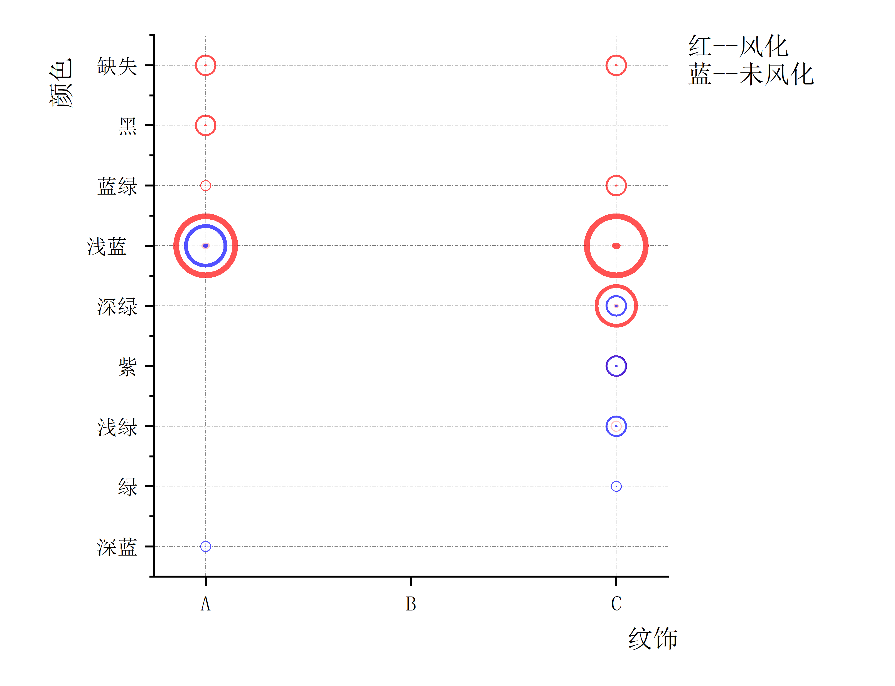
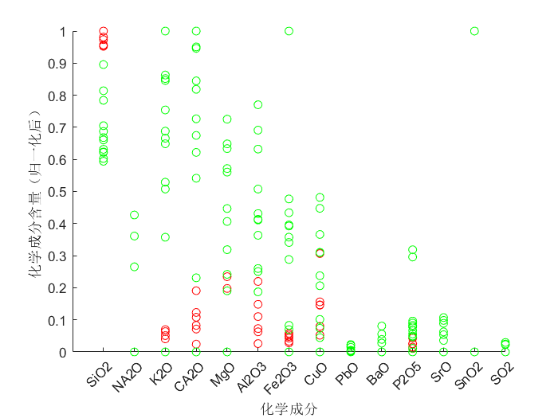
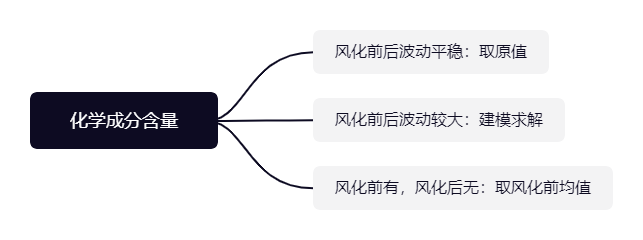
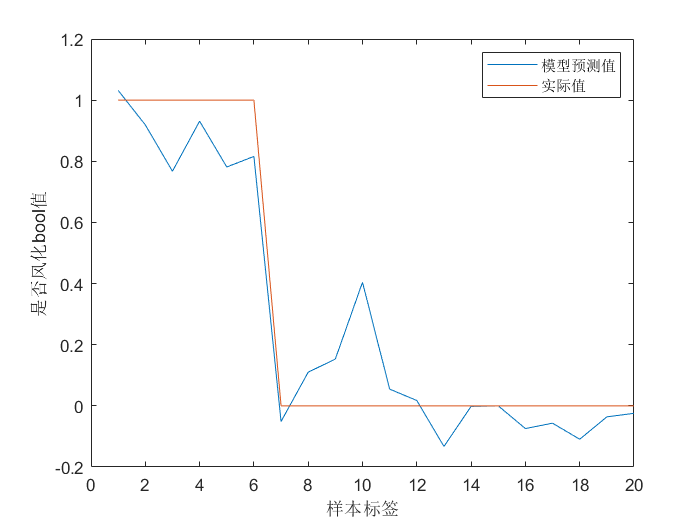

<style>
    .red{
        color:red;
    }
</style>


## 4. 问题1模型的建立与分析

### 4.1 风化结果与玻璃类型、纹饰与颜色的关系的描述性分析

首先对数据的整体进行刻画，绘制以玻璃类型、纹饰和颜色为自变量，是否风化为因变量的三维散点气泡图，如图1所示。

为了得到更加具体的关系特征，对图像进行降维处理，分别得到高钾玻璃和铅钡玻璃的纹饰、颜色与有无分化关系的二维散点图，如图2和图3所示。


由图，可以得出如下的规律：
+ (i) 由高钾玻璃的二维图，可以观察到高钾玻璃中B纹饰——紫颜色的种类风化结果表现为风化，且数据样本较多，其他类型的纹饰与颜色均表现为未风化；
+ (ii) 由铅钡玻璃的二维图，可以观察到A纹饰的浅蓝色同时表现出了未风化、风化两种结果，推测当A纹饰的铅钡玻璃介于风化与未风化的过渡地带时，往往呈现出浅蓝色，而A纹饰的其他颜色都具有较好的区分属性，如A纹饰——深蓝色表现为未风化，而A纹饰——蓝绿色/黑色/缺失颜色均表现为风化；
+ (iii) 由铅钡玻璃的二维图，可以观察到C纹饰的深绿色、紫色、浅绿色同时表现出了未风化、风化两种结果，推测当C纹饰的铅钡玻璃介于风化与未风化的过渡地带时，往往呈现出这三种颜色，而C纹饰的其他颜色，如C纹饰——绿色表现为未风化，C纹饰——蓝绿色/缺失颜色均表现为风化。

基于上述的规律，本文做出了三个维度数据与风化结果的关系特征的推导：
+ 1. 玻璃类型会对风化结果产生较显著的影响，铅钡玻璃风化比重比高钾玻璃大
+ 2. 风化过程中会存在<b>颜色的渐变</b>，这种渐变过程会因玻璃类型和纹饰存在差异，如铅钡玻璃的C纹饰，初始为绿色，经过风化由于化学成分改变逐渐变成浅绿、深绿的过度颜色，最终被完全风化，变成蓝绿色。


### 4.2 基于Spearman相关系数的按含量比例分类的分类模型

本文设计了基于Spearman相关系数的按含量比例分类的模型，具体流程如下所示：

首先针对高钾玻璃做具体的流程分析：
+ Step1： 绘制高钾玻璃风化前后的各个归一化后的化学成分含量的散点图，观察数据特征。
  
  由图4可以初步得出，高钾玻璃风化前后对部分化学成分含量有较大影响，其中，对$SiO_{2}$的含量有正向影响、对$K_{2}O$、$CaO$、$MgO$、$Al_{2}O_{3}$、$Fe_{2}O_{3}$、$CuO$、$P_{2}O_{5}$的含量有负向影响。

+ Step2: 计算高钾玻璃各个化学成分的Spearman相关系数。
  Spearman相关系数的计算公式如下所示：
  $$\rho_{X_{i}, X_{j}}=\frac{\operatorname{cov}(X_{i}, X_{j})}{\sigma_{X_{i}} \sigma_{X_{j}}}=\frac{E\left[\left(X_{i}-\mu_{X_{i}}\right)\left(X_{j}-\mu_{X_{j}}\right)\right]}{\sigma_{X_{i}} \sigma_{X_{j}}}$$
  若某两种Spearman相关性较大，则可以推测在风化前后这两种化学成分极可能存在某种化学转换关系，结合步骤1，由于众多成分中只有$SiO_{2}$含量明显减少，故主要探究$SiO_{2}$与其他化学成分含量的Spearman系数，将较大的系数值标粗，得到的表如表1所示。

    <p class=red>插入 “问题一相关的表”中的 “关于风化的化学成分相关性检验” 中的 “高钾成分相关性”表格 </p>

  以Spearman相关系数0.6为分界，选出与 $SiO_{2}$相关性最强的五个化学成分，分别为：$K_{2}O$、$CaO$、$MgO$、$Al_{2}O_{3}$、$Fe_{2}O_{3}$，此结果与步骤一的结果得到了相互印证。

+ Step3：以化学成分含量的比例作为是否风化的依据。
  基于上述分析，构造$SiO_{2}$与其他五个化学成分的比例关系$p_{1}$,$p_{1}$公式如下所示: 
  $$p_{1}=\frac{n(SiO_{2})}{n(K_{2}O)+n(CaO)+n(MgO)+n(Al_{2}O_{3})+n(Fe_{2}O_{3})}$$
  各个高钾玻璃的文物样品的$p_{1}$如表2所示，由于篇幅关系，仅展示6个风化样品与6个未风化样品的$p_{1}$值，完整表格见附录n。

  <p class=red>插入 “问题一相关的表”中的 “表2_K" 中的前12行 </p>

  依照表格信息，可以选取$p_{1}=10.7$作为区分高钾玻璃风化与否的依据。

 + Step4：总结统计规律
  <b>当高钾玻璃中的$p_{1}=\frac{n(SiO_{2})}{n(K_{2}O)+n(CaO)+n(MgO)+n(Al_{2}O_{3})+n(Fe_{2}O_{3})}$大于10.7时，高钾玻璃出现风化，小于10.7时，高钾玻璃不风化。</b>

  接着对铅钡玻璃进行分析，铅钡玻璃的分析流程与高钾玻璃类似，首先得出铅钡玻璃的风化前后化学成分含量的散点图，如图5所示
  
  从图中除了能分析出风化后$SiO_{2}$含量减少之外，较难分析铅钡玻璃中风化前后化学成分的变化，故需要求解Spearman相关系数进行进一步观察，得到的表格如表3所示。

   <p class=red>插入 “问题一相关的表”中的 “关于风化的化学成分相关性检验” 中的 “铅钡玻璃属性相关性”表格 </p>

   从中提取出与$SiO_{2}$相关性较强的$PbO$、$CuO$、$BaO$三个化学成分，同样地，构造$SiO_{2}$与这三个化学成分含量的比例关系值$p_{2}$,即
   $$p_{2}=\frac{n(SiO_{2})}{n(PbO)+n(CuO)+n(BaO)}$$,各个铅钡玻璃的文物样品的$p_{1}$如表4所示，由于篇幅关系，仅展示7个风化样品与7个未风化样品的$p_{2}$值，完整表格见附录n+1。

   <p class=red>插入 “问题一相关的表”中的 “表4_Pb" 中的7+7行 </p>

   依照表4信息，选取$p_{2}=0.70$作为分解规律，得到如下结论：

   <b>当铅钡玻璃中的$p_{2}=\frac{n(SiO_{2})}{n(PbO)+n(CuO)+n(BaO)}$大于0.7时，高钾玻璃出现风化，小于0.7时，高钾玻璃不风化。</b>此分类结果不完全准确，有3个样本不符合此规律，分别是11，36和48。

### 4.3 基于反向传播变换的线性逻辑回归的预测模型

  预测风化前化学成分含量之前，先将其中的化学成分分为三类，如图6所示。
  
  其模型算法流程如图7所示。
  

  本文首先对高钾玻璃风化前的化学成分进行预测，预测过程如下：
##### 4.3.1 选取特征（化学成分含量）
  特征量的选取主要基于图4，由上述分析可知，风化前后只对$SiO_{2}$、$K_{2}O$、$CaO$、$MgO$、$Al_{2}O_{3}$、$Fe_{2}O_{3}$、$CuO$的含量有显著影响，故将这七个化学成分含量视为系统输入的特征值。为了方便表达，选取的七个特征值依次用$x_{1}$、$x_{2}$......$x_{7}$表示。
  对于其他含量，风化前后波动较平稳的$P_{2}O_{5}$使用原值近似预测值，风化后消失的元素使用风化前元素的平均值近似预测值。
  

##### 4.3.2 建立线性逻辑回归方程
   + <b>step1</b> 构建一般方程
  引入sigmoid函数，sigmoid有两个特性，第一个是其函数值在趋于正无穷或负无穷时，函数趋近平滑状态，第二个是sigmoid函数输出范围为（0，1），因此，sigmoid函数经常用于二分类问题，其函数表达式如下所示：
  $$\sigma(z)=\frac{1}{1+\mathrm{e}^{-z}}$$
  为了建立输出与特征的关系，考虑使用$x_{i}$的线性表达来替代$z$,则z可以被表达为
  $$z=w_{0}+w_{1}\cdot x_{1} + w_{2}\cdot x_{2}+....+w_{7} \cdot x_{7} = \vec{w} ^{T} \cdot \vec{x}$$
  具体到本问题中，$\vec{w}$、$\vec{x}$的维度是8，且$\vec{x}$的第一个元素是1，将与$w_{0}$相乘，形成偏置。此时，线性逻辑回归的表达式就可以表达为：
  $$\sigma_{w}(x)=\frac{1}{1+\mathrm{e}^{-\vec{w} ^{T} \cdot \vec{x}}}$$
 + <b>step2</b> 构建逻辑回归的损失函数
  单个样本点的损失值记为$cost$，构造如下所示的$cost$的表达式。
  $$\operatorname{cost}\left(\sigma_{w}(x), y\right)=\left\{\begin{aligned}
-\log \left(\sigma_{w}(x)\right) & \text { if } y=1 \\
-\log \left(1-\sigma_{w}(x)\right) & \text { if } y=0
\end{aligned}\right.$$
  构建cost表达式后，就可以构建出逻辑回归的损失函数
  $$\begin{aligned}
J(\theta) &=\frac{1}{m} \sum_{i=1}^{m} \operatorname{cost}\left(\sigma_{w}\left(x^{(i)}\right), y^{(i)}\right) \\
&=-\frac{1}{m}\left[\sum_{i=1}^{m} y^{(i)} \log \sigma_{w}\left(x^{(i)}\right)+\left(1-y^{(i)}\right) \log \left(1-\sigma_{w}\left(x^{(i)}\right)\right)\right]
\end{aligned}$$
+ <b>step3</b> 代入数据，训练模型
  代入高钾玻璃的数据，标记风化为1，无风化为0，进行训练，通过对损失函数求偏导更新参数，最终建立逻辑回归方程。
+ <b>step4</b> 方程准确度的验证
  如图6，为方程预测值与实际值的差值
  
  方程的具体参数如表5所示。
  
  <p class=red>在这里插入“表5”！！</p>

##### 4.3.3 化学成分含量的反向传播
  本文通过按照一定比例依次调整风化后样本的化学成分含量，直到逻辑回归的方程判定由“1”变为“0”为止，达到预测风化前化学成分含量的效果。由于是对多组化学变量同时调整，故需要设定不同的调整幅度，此幅度由不同化学成分含量风化前后的均值的变化量之比决定。幅度比如下所示：
  $$\bigtriangleup \mu_{CuO}:\bigtriangleup \mu_{Fe_{2}O_{3}}:\bigtriangleup \mu_{Al_{2}O_{3}}:\bigtriangleup \mu_{MgO}:\bigtriangleup \mu_{CaO}:\bigtriangleup \mu_{K_{2}O}:\bigtriangleup \mu_{SiO_{2}}=1:2.166:5.587:1.213:5.209:11.814:-37.913$$
  本算法的伪代码如下所示：
  ```
  Init mu，alpha       #初始化上述比例系数行向量，alpha为幅值系数，本例设为0.005
  while :
    x = x*(1+alpha*mu) #更新x，每个x的更新幅度由mu决定
    if (f(x)==0):
      break            #若经过逻辑回归判定为0，未风化，则跳出循环
  ```
  更新后，得到六组风化后的高钾玻璃的化学成分的预测量，如表6所示，结果同样将展示在附录七的表格中。

  <p class=red>在这里插入“表6”！！</p>

对于铅钡玻璃的化学成分的预测量，采用同样的预测方式，由于铅钡玻璃各个成分变化均较大，故选取铅钡的除了二氧化硫的十三个化学成分进行训练，构建铅钡玻璃的逻辑回归模型，最终反向更新化学成分含量，得到铅钡玻璃风化前化学成分的预测量，具体预测值见附录n++。

<p class=red>对应的附录贴“问题一相关excel”中的“铅钡预测附录”</p>
  


  
