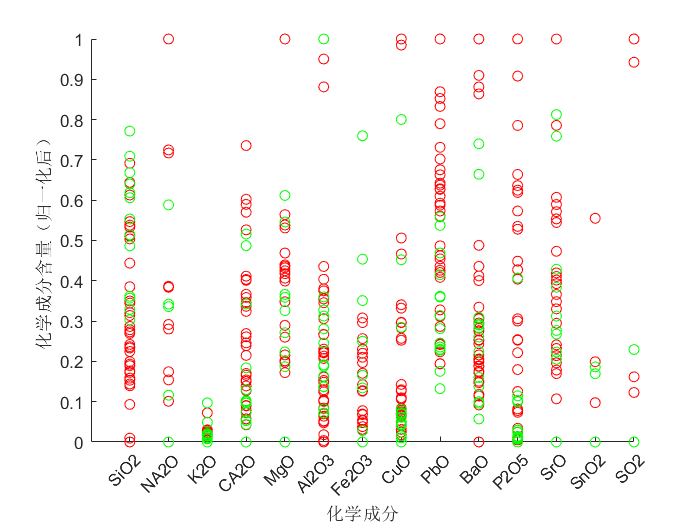

## 4. 问题1模型的建立与分析

### 4.1 风化结果与玻璃类型、纹饰与颜色的关系的描述性分析

首先对数据的整体进行刻画，绘制以玻璃类型、纹饰和颜色为自变量，是否风化为因变量的三维散点气泡图，如图1所示。

为了得到更加具体的关系特征，对图像进行降维处理，分别得到高钾玻璃和铅钡玻璃的纹饰、颜色与有无分化关系的二维散点图，如图2和图3所示。

由图，可以得出如下的规律：
+ (i) 由高钾玻璃的二维图，可以观察到高钾玻璃中B纹饰——紫颜色的种类风化结果表现为风化，且数据样本较多，其他类型的纹饰与颜色均表现为未风化；
+ (ii) 由铅钡玻璃的二维图，可以观察到A纹饰的浅蓝色同时表现出了未风化、风化两种结果，推测当A纹饰的铅钡玻璃介于风化与未风化的过渡地带时，往往呈现出浅蓝色，而A纹饰的其他颜色都具有较好的区分属性，如A纹饰——深蓝色表现为未风化，而A纹饰——蓝绿色/黑色/缺失颜色均表现为风化；
+ (iii) 由铅钡玻璃的二维图，可以观察到C纹饰的深绿色、紫色、浅绿色同时表现出了未风化、风化两种结果，推测当C纹饰的铅钡玻璃介于风化与未风化的过渡地带时，往往呈现出这三种颜色，而C纹饰的其他颜色，如C纹饰——绿色表现为未风化，C纹饰——蓝绿色/缺失颜色均表现为风化。

基于上述的规律，本文做出了三个维度数据与风化结果的关系特征的推导：
+ 1. 玻璃类型会对风化结果产生较显著的影响，铅钡玻璃风化比重比高钾玻璃大
+ 2. 风化过程中会存在<b>颜色的渐变</b>，这种渐变过程会因玻璃类型和纹饰存在差异，如铅钡玻璃的C纹饰，初始为绿色，经过风化由于化学成分改变逐渐变成浅绿、深绿的过度颜色，最终被完全风化，变成蓝绿色。

### 4.2 基于皮尔逊相关系数的按含量比例分类的分类模型

本文设计了基于皮尔逊相关系数的按含量比例分类的模型，具体流程如下所示：

首先针对高钾玻璃做具体的流程分析：
+ Step1： 绘制高钾玻璃风化前后的各个归一后的化学成分含量的散点图，观察数据特征。
  
  由图4可以初步得出，高钾玻璃风化前后对部分化学成分含量有较大影响，其中，对$SiO_{2}$的含量有正向影响、对$K_{2}O$、$CaO$、$MgO$、$Al_{2}O_{3}$、$Fe_{2}O_{3}$、$CuO$、$P_{2}O_{5}$的含量有负向影响。

+ Step2: 计算高钾玻璃各个化学成分的皮尔逊相关系数。
  皮尔逊相关系数的计算公式如下所示：
  $$\rho_{X_{i}, X_{j}}=\frac{\operatorname{cov}(X_{i}, X_{j})}{\sigma_{X_{i}} \sigma_{X_{j}}}=\frac{E\left[\left(X_{i}-\mu_{X_{i}}\right)\left(X_{j}-\mu_{X_{j}}\right)\right]}{\sigma_{X_{i}} \sigma_{X_{j}}}$$
  若某两种皮尔逊相关性较大，则可以推测在风化前后这两种化学成分极可能存在某种化学转换关系，结合步骤1，由于众多成分中只有$SiO_{2}$含量明显减少，故主要探究$SiO_{2}$与其他化学成分含量的皮尔逊系数，将较大的系数值标粗，得到的表如表1所示。

    
插入 “问题一相关的表”中的 “关于风化的化学成分相关性检验” 中的 “高钾成分相关性”表格 

  以皮尔逊相关系数0.6为分界，选出与 $SiO_{2}$相关性最强的五个化学成分，分别为：$K_{2}O$、$CaO$、$MgO$、$Al_{2}O_{3}$、$Fe_{2}O_{3}$，此结果与步骤一的结果得到了相互印证。

+ Step3：以化学成分含量的比例作为是否风化的依据。
  基于上述分析，构造$SiO_{2}$与其他五个化学成分的比例关系$p_{1}$,$p_{1}$公式如下所示: 
  $$p_{1}=\frac{n(SiO_{2})}{n(K_{2}O)+n(CaO)+n(MgO)+n(Al_{2}O_{3})+n(Fe_{2}O_{3})}$$
  各个高钾玻璃的文物样品的$p_{1}$如表2所示，由于篇幅关系，仅展示6个风化样品与6个未风化样品的$p_{1}$值，完整表格见附录n。

  
插入 “问题一相关的表”中的 “表2_K" 中的前12行 

  依照表格信息，可以选取$p_{1}=10.7$作为区分高钾玻璃风化与否的依据。

 + Step4：总结统计规律
  <b>当高钾玻璃中的$p_{1}=\frac{n(SiO_{2})}{n(K_{2}O)+n(CaO)+n(MgO)+n(Al_{2}O_{3})+n(Fe_{2}O_{3})}$大于10.7时，高钾玻璃出现风化，小于10.7时，高钾玻璃不风化。</b>

  接着对铅钡玻璃进行分析，铅钡玻璃的分析流程与高钾玻璃类似，首先得出铅钡玻璃的风化前后化学成分含量的散点图，如图5所示
  
  从图中除了能分析出风化后$SiO_{2}$含量减少之外，较难分析铅钡玻璃中风化前后化学成分的变化，故需要求解皮尔逊相关系数进行进一步观察，得到的表格如表3所示。

   
插入 “问题一相关的表”中的 “关于风化的化学成分相关性检验” 中的 “铅钡玻璃属性相关性”表格 

   从中提取出与$SiO_{2}$相关性较强的$PbO$、$CuO$、$BaO$三个化学成分，同样地，构造$SiO_{2}$与这三个化学成分含量的比例关系值$p_{2}$,即
   $$p_{2}=\frac{n(SiO_{2})}{n(PbO)+n(CuO)+n(BaO)}$$,各个铅钡玻璃的文物样品的$p_{1}$如表4所示，由于篇幅关系，仅展示7个风化样品与7个未风化样品的$p_{2}$值，完整表格见附录n+1。

   
插入 “问题一相关的表”中的 “表4_Pb" 中的7+7行 

   依照表4信息，选取$p_{2}=0.70$作为分解规律，得到如下结论：

   <b>当铅钡玻璃中的$p_{2}=\frac{n(SiO_{2})}{n(PbO)+n(CuO)+n(BaO)}$大于0.7时，高钾玻璃出现风化，小于0.7时，高钾玻璃不风化。</b>此分类结果不完全准确，有3个样本不符合此规律，分别是11，36和48。

  ### 4.3 

