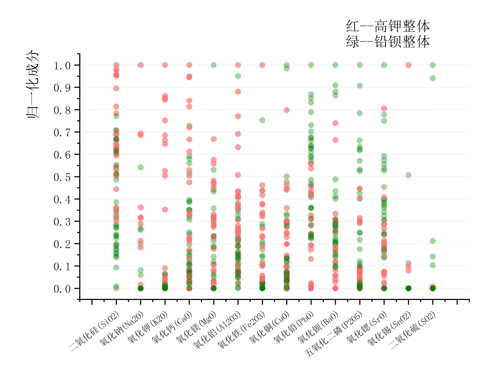
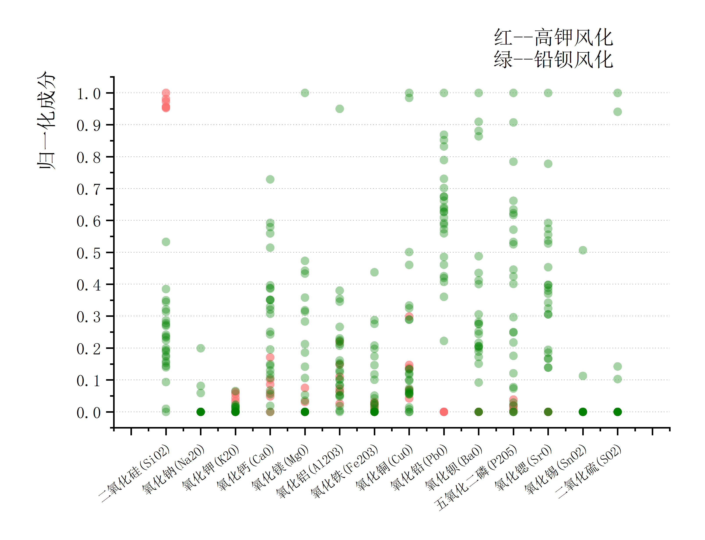
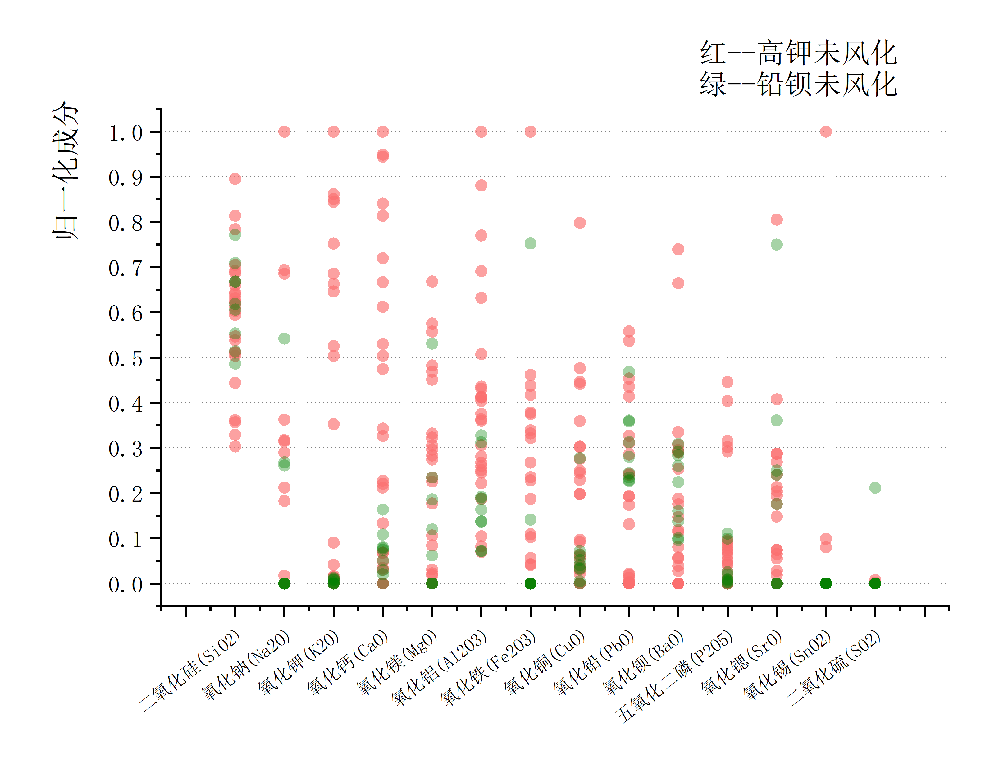

# 四、问题二模型的建立与求解
## 4.1 高钾、铅钡玻璃分类规律的描述性统计分析
本文首先将预处理好的附件表二中玻璃类别与14种化学组成成分的关系用散点图进行可视化分析，
得到“所有玻璃文物类别与成分关系图”、“风化玻璃文物类别与成分关系图”和“未风化玻璃文物类别与成分关系图”
对类别与成分之间的关系进行直观的定性分析； 随后计算类别与单个化学成分之间的$spearman$相关系数
对类别与成分之间的关系做定量分析。
### 4.1.1 统计规律的定性分析
所有玻璃文物类别与成分关系散点图如下：

图4-1 所有玻璃文物的类别与成分关系是散点图

从图中可以看出：高钾玻璃的氧化钾含量基本上高于比铅钡玻璃，且有较明显的分界线；
而高钾玻璃的氧化铅含量普遍低于铅钡玻璃。
在二氧化硅含量方面，高钾玻璃的含量大多偏高，而铅钡玻璃的含量则相对中等，整体趋势高钾玻璃的二氧化硅含量更高，
但二者含量的交集也不少。

将预处理后的表二数据按照风化与否分别画出玻璃类别与化学成分含量的散点图如下：

图4-2 风化玻璃的类别与成分关系散点图

从风化玻璃的类别与成分关系散点图可以看出：风化后的高钾玻璃的二氧化硅含量明显高于风化后的铅钡玻璃，
且可以看出风化后的高钾玻璃化学成分含量集中在二氧化硅上；
风化后的高钾玻璃不含氧化铅与氧化钡，而风化后的铅钡玻璃的氧化铅和氧化钡的含量很高； 
从未风化玻璃的类别与成分关系散点图可以看出：未风化的高钾玻璃在氧化纳、氧化钾和氧化钙含量上明显高于铅钡玻璃且有较明显的分界；
而未风化的高钾玻璃在氧化铅和氧化钡上含量明显低于铅钡玻璃。

### 4.1.2 统计规律的定量分析
在4.1.1节通过散点图进行了定性分析后，本文通过计算类别与各化学成分之间的$spareman$相关系数，
进一步分析玻璃分类的统计规律。 
首先，所有玻璃文物的类别与化学成分之间的$spareman$相关系数如下表所示：

插入 “excel里问题二待插入表”中的 “表4-1所有玻璃文物的类别与成分的spareman相关系数表 

表4-1 所有玻璃文物的类别与成分的spareman相关系数表

从表中可以看出：在P值为0.01的条件下，玻璃类别与氧化铅、氧化钡有较强的相关性：氧化铅和氧化钡的含量越高，
越有可能是铅钡玻璃；其他相关性并不明显。  
接着分别分析风化与否的玻璃类别与化学成分之间的$spareman$相关系数，结果如下所示：

插入 “excel里问题二待插入表”中的 “表4-2未风化玻璃文物的类别与成分的spareman相关系数表 

表4-2 未风化玻璃文物的类别与成分的spareman相关系数表

从未风化玻璃文物的类别与成分的spareman相关系数表中可以看出：在P值为0.01的条件下，
玻璃类别与氧化铅、氧化钡和氧化钾有极强的相关性：氧化铅和氧化钡的含量越高， 越有可能是铅钡玻璃；
而氧化钾的含量越高越有可能是高钾玻璃； 
从风化玻璃文物的类别与成分的spareman相关系数表中可以看出，在P值为0.01的条件下，
玻璃类别与二氧化硅、氧化钡、氧化铅和氧化锶的含量有着一般的相关性：风化玻璃的二氧化硅含量越高，
越有可能是高钾玻璃类型；氧化钡、氧化铅和氧化锶的含量越高，越有可能是铅钡玻璃类型。  
### 4.1.3 分类规律总述
